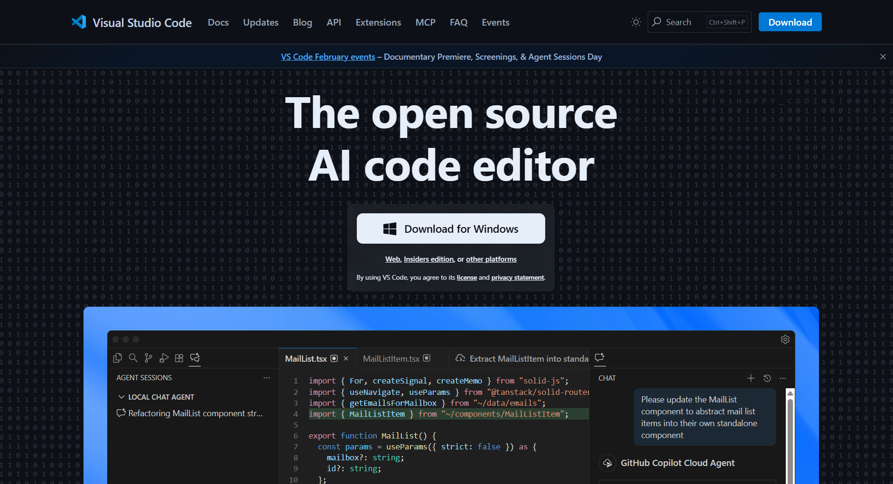
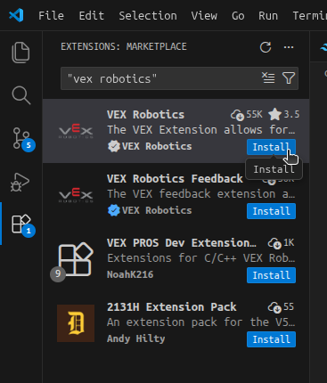
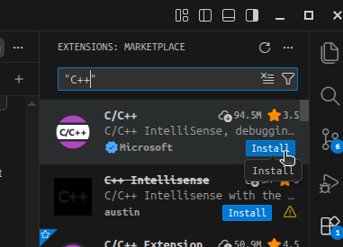
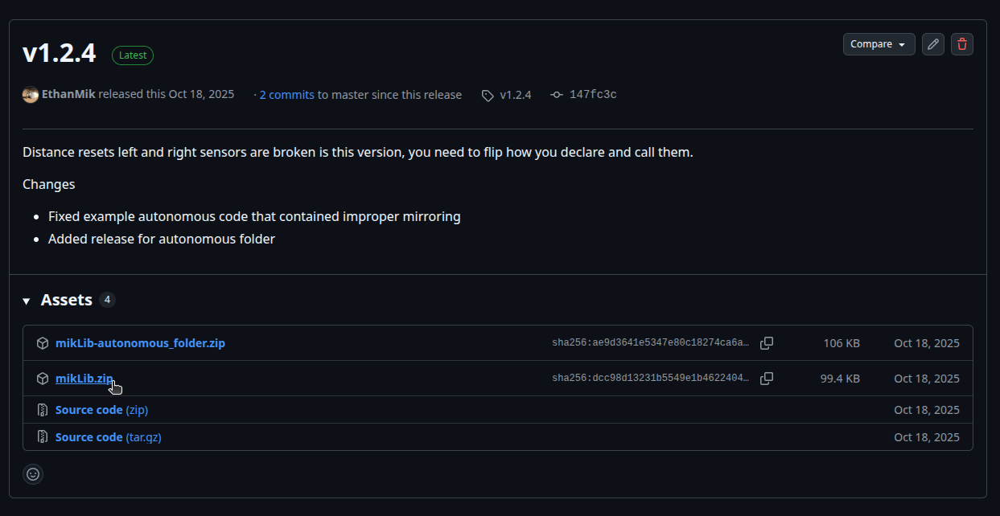
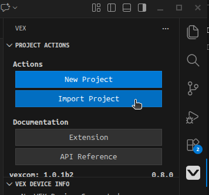
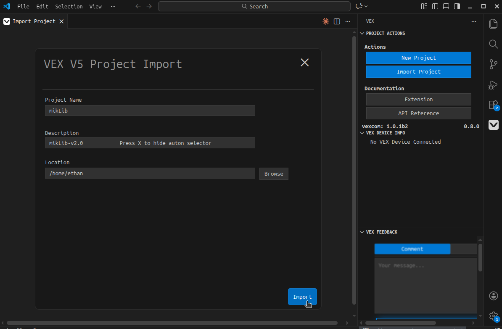
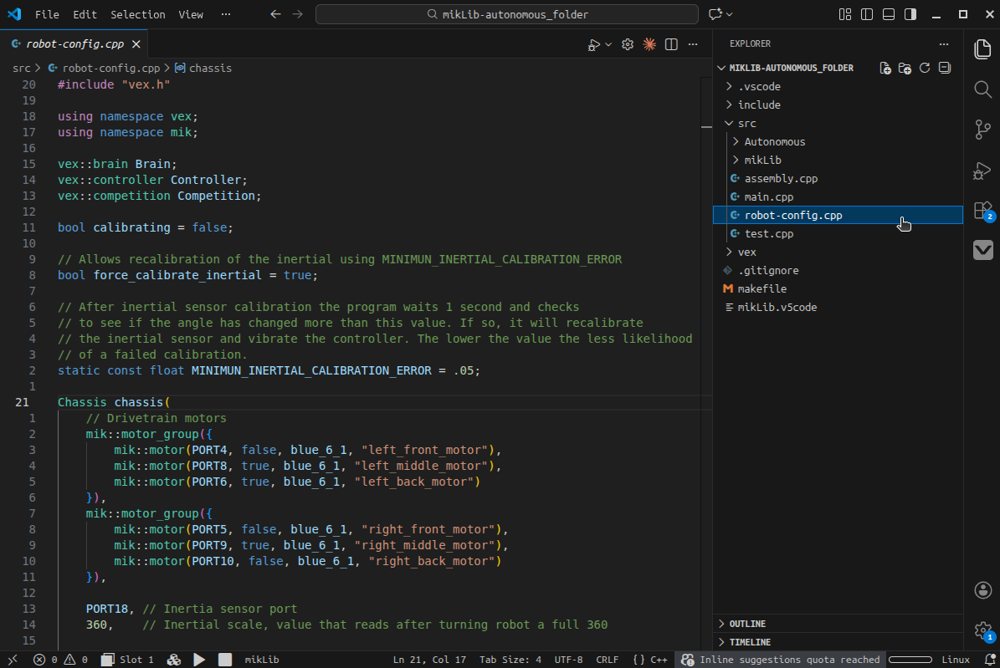

# Getting Started

How to install mikLib

## Installing VS Code

VS Code is the recommended code editor, click the link [here](https://code.visualstudio.com/) and follow the installation startup. Open VS Code to get started.

## Installing VEX Robotics Extension

The [VEX Robotics Extension](https://www.vexrobotics.com/vexcode/vscode-extension) is what allows you to build and upload
code to the Brain, to install it you want to navigate to the extensions tab
on the left hand and search for "vex robotics" and press install as shown.

## Installing C++ Extension

The [C/C++ Extension](https://marketplace.visualstudio.com/items?itemName=ms-vscode.cpptools) provides syntax highlighting, auto-complete and error detection 
for your VEX code. You can install it the same way as the VEX Robotics Extension, search for "C++"

## Installing mikLib

To install mikLib navigate to the [latest release](https://github.com/EthanMik/mikLib/releases/latest) on the mikLib repository and click on "mikLib.zip". If you want a separate folder for each auton you can download "mikLib-autonomous-folder.zip".

To import the template into VS Code you want to click on the VEX logo on your extensions bar, press Import Project, 
then click on mikLib.zip from your downloads.

You should see this screen, give you project a name and give it a location, press import again, and mikLib 
should open in location specified.

Navigate to the folder src then robot-config.cpp to get started!

